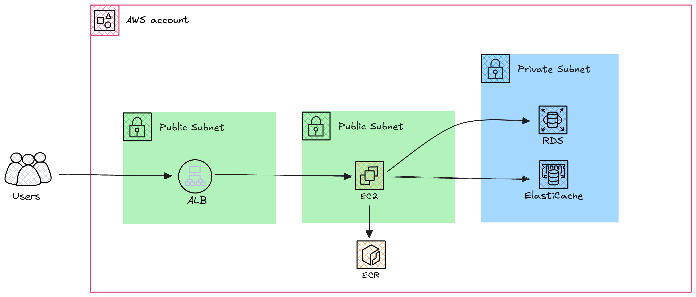

# Project Concept

This project focuses on developing a scalable online platform for a bookstore. The application integrates a reliable backend and a dynamic frontend. The backend manages user authentication, book inventory, and order processing, while the frontend provides a seamless and engaging user experience for browsing and purchasing books. Additionally, caching mechanisms are employed to enhance performance, ensuring a robust and efficient user experience.

# Project Overview

This project is structured into three primary components: backend services (RDS and Redis), and the frontend. Each component plays a critical role in delivering a comprehensive solution. Below is a summary of the key elements:

- **Backend (RDS)**: Built with a focus on scalability and reliability, managing relational database operations.
- **Backend (Redis)**: Optimized for session caching and quick access to frequently used data.
- **Frontend**: Designed to provide a dynamic and interactive user interface.

The platform utilizes PostgreSQL for database management and Redis for caching, ensuring optimal performance.

## File Structure

### 1. **Backend (RDS)**
- **Purpose**: Manages application logic and integrates with a relational database service.
- **Files**:
  - `manage.py`: Entry point for the backend application.
  - `requirements.txt`: Lists dependencies for the project.
  - `backend_rds/`: Contains the core backend logic, configuration files, and routes for the application.

### 2. **Backend (Redis)**
- **Purpose**: Handles backend logic with Redis for caching.
- **Files**:
  - `manage.py`: Entry point for the backend application.
  - `requirements.txt`: Lists dependencies for the project.
  - `backend_redis/`: Contains the core backend logic, configuration files, and routes for the application.

### 3. **Frontend**
- **Purpose**: Provides the user interface.
- **Files**:
  - `manage.py`: Entry point for the frontend application.
  - `requirements.txt`: Lists frontend dependencies.
  - `frontend/`: Contains configuration files, routing, views, and templates for the frontend interface.

## Lifehacks

**Use ChatGPT everywhere**

**But don't ask it to write the code or solutions for you.**

Initially, use it to understand the diagram, all the interconnections on it, and why everything is arranged this way.

Next, use it when taking courses to find the information you need for the project's implementation. Use it here to deepen your understanding, create more examples and analogies. Break concepts into the simplest levels of abstraction and show maximum creativity when working with it.

Refer back to the course we took initially (about ChatGPT), recall the methods and strategies of prompts, and use them.
Your main task is not just to implement the project but to learn how to break down new information into the simplest pieces with ChatGPT and build understanding as quickly as possible.

## Deployment

### Backend Services
- Deploy the backend services using EC2 instances and AWS services as specified in the three integration steps.

### Frontend
- Deploy the frontend service using EC2 instances behind the ALB for a consistent and scalable deployment strategy.

### Dockerization
- All services should be containerized using Docker to ensure ease of scaling and deployment.

### CI/CD Process
- Implement separate CI/CD pipelines for backend and frontend deployment to automate the process effectively.

This structured AWS integration ensures a robust, scalable, and secure deployment for the online bookstore platform.

## AWS Deployment

### Step 1: Deploying the Basic Architecture

In the first step, deploy the application with a simple setup:
- Launch an EC2 instance in a **public subnet** for hosting the application backend.
- Use **Amazon ECR** for managing container images.

This step ensures that the backend application is accessible and containerized for consistency across environments.

### Step 2: Introducing Load Balancing

In the second step, enhance scalability and availability:
- Add an **Application Load Balancer (ALB)** in the **public subnet** to distribute traffic across multiple EC2 instances.
- Use multiple EC2 instances for the backend to handle increased traffic efficiently.
- Continue using **Amazon ECR** for container management.

This step ensures fault tolerance and improves performance under higher loads.

### Step 3: Incorporating Databases and Caching

In the final step, integrate data storage and caching:
- Deploy **RDS** and **ElastiCache (Redis)** in a **private subnet** for secure database and caching operations.
- Keep the ALB and EC2 instances in the **public subnet** to handle user requests and forward them to the backend.
- Maintain the **Amazon ECR** for containerized deployment.

This step ensures secure and efficient handling of relational data and cached sessions, optimizing both performance and security.